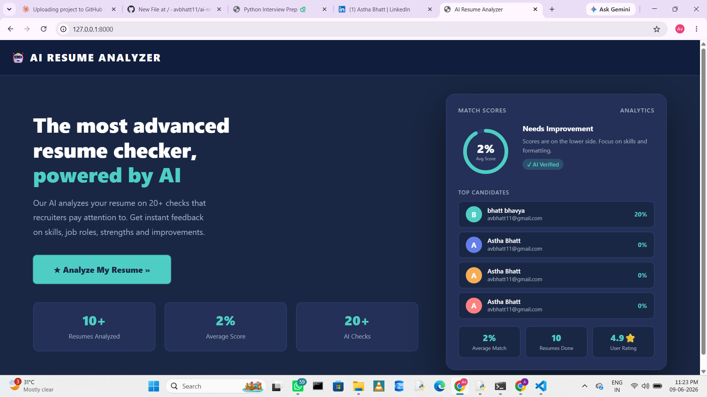
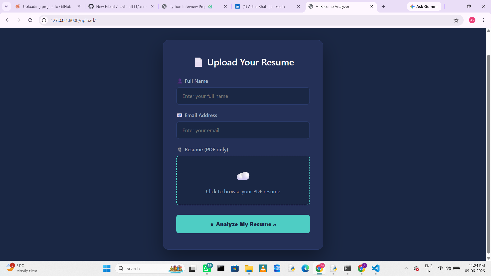
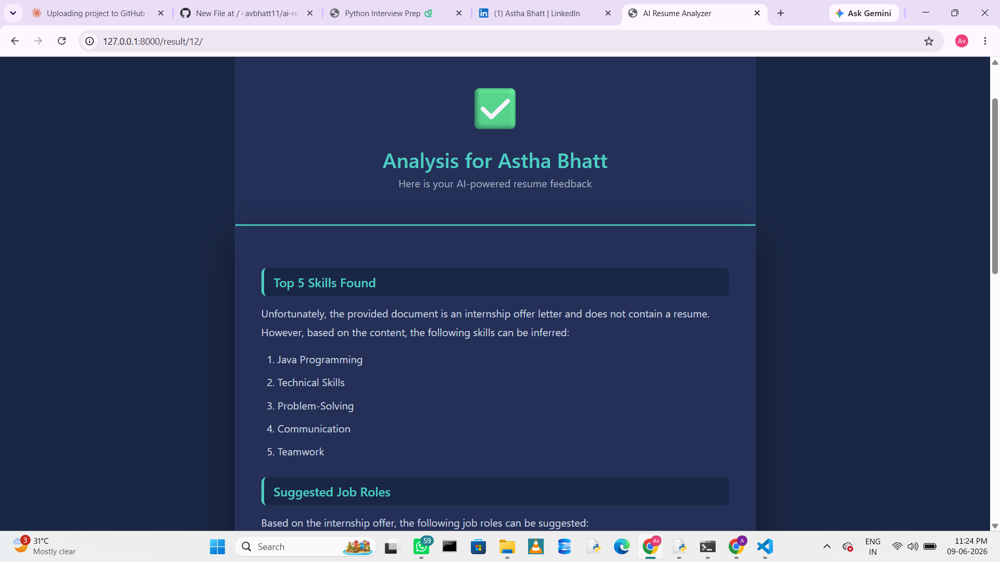

# 🤖 AI Resume Analyzer

An intelligent web application that analyzes resumes using **Google Gemini AI** and provides detailed feedback to help job seekers improve their resumes.

---

## ✨ Features

- 📤 Upload resume in **PDF format**
- 🤖 AI-powered analysis using **Google Gemini API**
- 📊 Dynamic dashboard with analysis history
- 💡 Detailed feedback on resume strengths & weaknesses
- 🎯 Skill gap identification and improvement suggestions
- 🌙 Professional dark navy UI
- 📝 Markdown rendering for structured AI feedback

---

## 🛠️ Tech Stack

| Technology | Type | Purpose |
| Python | Language | Backend logic |
| Django | Framework | Website structure |
| SQLite | Database | Data store |
| HTML | Language | Page structure |
| CSS | Language | Design & animations |
| JavaScript | Language | Interactive features |
| Bootstrap 5 | Framework | Ready-made styling |
| Gemini AI | API | AI analysis |
| PyPDF2 | Library | PDF reading |
| Marked.js | Library | Markdown rendering |

---

## ⚙️ Installation & Setup

### 1. Clone the repository
```bash
git clone https://github.com/avbhatt11/ai-resume-analyzer.git
cd ai-resume-analyzer
```

### 2. Create virtual environment
```bash
python -m venv venv
venv\Scripts\activate
```

### 3. Install dependencies
```bash
pip install -r requirements.txt
```

### 4. Create `.env` file

SECRET_KEY=your_django_secret_key
GEMINI_API_KEY=your_google_gemini_api_key

### 5. Run migrations
```bash
python manage.py makemigrations
python manage.py migrate
```

### 6. Start the server
```bash
python manage.py runserver
```

---

## 👩‍💻 Author

**Astha Bhatt**
- 🔗 GitHub: [@avbhatt11](https://github.com/avbhatt11)
- 💼 LinkedIn: [Astha Bhatt][https://www.linkedin.com/in/astha-bhatt-45a27840a]

---

## 📜 License

This project is open source and available under the [MIT License](LICENSE).

---


## 📸 Screenshots

### Home Page


### Upload Page


### Result Page


⭐ **If you found this project helpful, please give it a star!**


